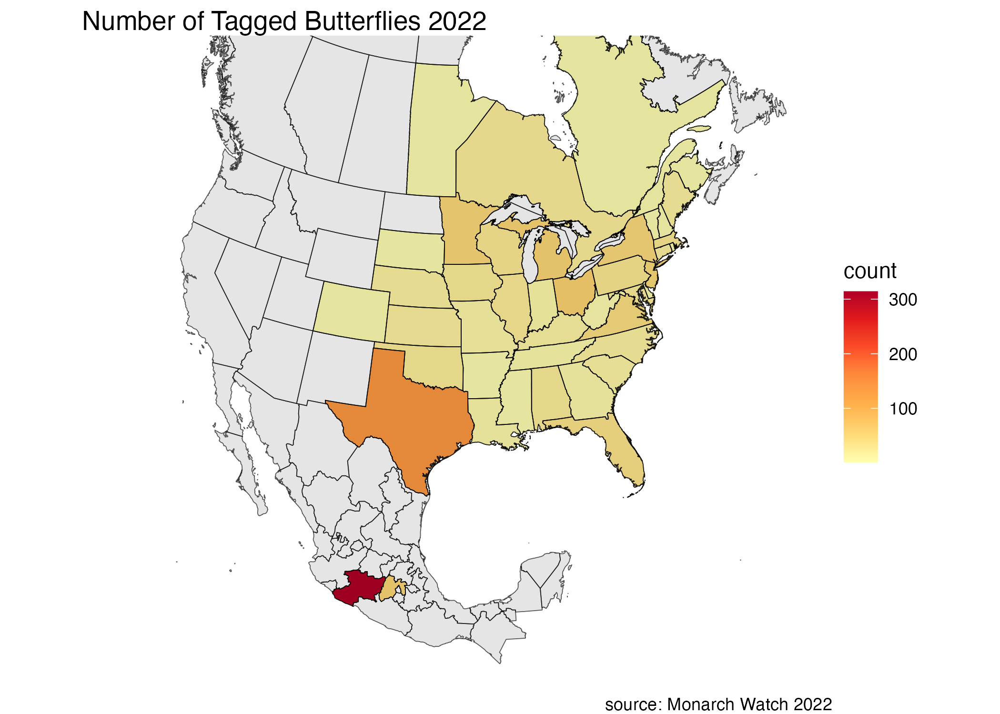

## Goals

In this lab you are making several maps. The primary goal is to et you to recognize the difference between a population map, and a normalize map. You will also practice a lot of the wrangling skills that you've build up in this course. Check the rubric, you will be graded on each of your maps.

Read each chunk carefully as there are several you do not need to run, but I left in case you were interested in the code.  

```{r}
#install.packages("googlesheets4")
library(googlesheets4)  #only use google sheets if you are not on the server. 
library(tidyverse)
library(janitor)
library(tidygeocoder)
library(sf)
```

Every year Monarch Butterflies fly south for the winter. They start in higher latitudes and migrate south to their wintering areas in Mexico.

[Monarch Watch](https://monarchwatch.org/blog/) is a citizen science initiative housed in the University of Kansas. Every year volunteers tag these butterflies and release them so their progress in their southern migration can be mapped. If someone finds a monarch with a tag they [can report it.](https://docs.google.com/forms/d/e/1FAIpQLSetTI4HYcyb1GfIyo-U5rAuVVezvOrwicz2ztIt244Vh7S4VA/viewform) We'll examine only the Eastern Monarch's trip south.

## Import and Clean Data

The data is saved both as a csv file in the data/ folder and is available online in the form of google sheets. It can be brought into R with the `googlesheets4` R package. If using google sheets, pay attention to your console, google needs permission to download.

After importing clean the names of the data frames

```{r}
# Run this chunk to load the data without google sheets (if you are not on the server).
us_can_recovery_2022 = read_csv("data/us_can_recovery.csv")
mexico_recovery_pre_2023 = read_csv("data/mexico_data.csv")
```

```{r}
#| eval: False
#| message: False

####################### If you are NOT on the server you can run this chunk ############################
####################### If you ARE on the server just run the chunk above   ############################

# US and Canada Data
us_can_recovery_2022 <- read_sheet("https://docs.google.com/spreadsheets/d/14ONbP-0rgvVz-DR0MWYkkPm0BzyFBHMiNCA2F5I8Yks/edit#gid=1710298744") 

# Mexico Recovery Data
mexico_recovery_pre_2023 <- read_sheet("https://docs.google.com/spreadsheets/d/1UdJfooBJrm0Y1zlpwIhGz7ToZfP9h8OeucJbXrWwZEY/edit#gid=1853245517")

# If you cannot get access to the above data run these two lines in the console. Otherwise ignore this message
# googlesheets4::gs4_deauth()
# googlesheets4::gs4_auth()

# clean the names here. 
us_can_recovery_2022 <- us_can_recovery_2022 |> clean_names()
mexico_recovery_pre_2023 <- mexico_recovery_pre_2023 |> clean_names()

write_csv(us_can_recovery_2022, "data/us_can_recovery.csv")
write_csv(mexico_recovery_pre_2023, "data/mexico_data.csv")

```

## North American Map

I found an old map of north america that we can use for this lab. If you find another reasonably sized North american map with the states and provices on it, please let me know. 

```{r}
# map data from https://earthworks.stanford.edu/catalog/stanford-ns372xw1938
# I made a North America Map for you. 

north_am = read_sf("data/north_america/")|>
  st_transform(crs = 4326)|> 
  filter(COUNTRY %in% c("MEX", "USA","CAN"))|>
  separate_wider_delim(STATEABB, delim = "-", names = c("country_abb","state_abb") ) |>
  st_as_sf()

```

Plot the map to make sure the states/provinces are shown are shown.

```{r}
# Map out north_am here. 
ggplot()+
  geom_sf(data = north_am)+
  theme_void()+
  coord_sf(xlim = c(-130, -60), ylim = c(15,60), default_crs = 4326, crs = 3978) # Note the change in projection, just for this map
```

## Find top 7 butterflies

I'd like to trace the paths of these butterflies on a map of the US. Each butterfly gets a tag. So if the same tag is repeated multiple times we can follow that butterfly's path.

Wrangle us_can_recovery_2022 to get the top 7 most spotted butterflies 2022. Then use pull() to save the most spotted tag codes as a vector so we can use it to filter later.

```{r tag_code}

# wrangle and pull here. 
top_7_most_spotted_2022 <- us_can_recovery_2022  |>
  count(tag_code) |>
  slice_max(n=7, order_by = n) |>
  pull(tag_code)

```

To map the butterfly sightings we need the location data for the top 7 butterflies. `filter()` for the top seven most seen butterflies, pipe that into `select()` to get the location of the city and state and finally pipe that information into `geocode()`. It takes `geocode()` sometime to produce lat and long data. Make sure your filtering works as expected before using `geocode()`. This will give us the lat and long at the city level. To be safe you should use st_as_sf() to give the proper map projection.

```{r}
##### Geocoding is annoying on the server. If you would rather build a tibble and manually write in the lat and long you can. If all is working correctly, this will take 7 seconds.


top_7_butterfly <- us_can_recovery_2022 |>
# wrangle here. 
  filter(tag_code %in% top_7_most_spotted_2022) |>
  select(tag_code,city_location,state_province) |>
  geocode(city = city_location, state= state_province)|>
  st_as_sf(coords = c("long", "lat"), crs = 4326)
```

In the code chunk below add your top 7 butterflies. Color them orange and consider increasing their size.

**Graded Map 1: Top 7**

```{r}
# Make your top 7 butterfly map here. 
north_am|>
  ggplot()+
  geom_sf() +
  geom_sf(data = top_7_butterfly, size = 3, color="orange")+
  theme_void()+
  coord_sf(xlim = c(-130, -60), ylim = c(15,60), default_crs = 4326, crs = 3978) # Note the change in projection.

```

This is not an exciting map, I only see 7ish dots, not seven butterflies travelling south. I guess one butterfly rarely gets spotted again across state boarders. This shows the limits of citizen science. Not many people participate so the data is spotty.

## Make a Chrolopleth map of the US and Canada.

Let's see what we can learn when we plot all of the butterflies from 2022 at the same time. I've previously geocoded butterfly location by the state level, as opposed to the city level to save time. The code to do that is below, if you are interested.  Getting location at the state level took `geocode()` 43 seconds instead of 8 minutes at the city level. Once I geocoded the data I used save() to save as an Rdata file, and load() to load it back in when you render. You should comment out the geocoding and save function afterward. (Read more about Rdata files [here](https://nathanieldphillips-yarrr.share.connect.posit.cloud/rdata-files.html)).
```{r}
#| eval: false

#butterfly_location_data_state <- us_can_recovery_2022 |>
#   select(tag_code,city_location,state_province,country, date)|>
#   geocode(state = state_province, country = country)

# This saves the data by state, so you don't have to geocode it everytime.
#  
#save(butterfly_location_data_state, file = "butterfly_location_data_state.Rdata")
```

```{r}
# This chunk will load in the saved geolocation of the butterflies.
# Note: The datra frame "butterfly_location_data_state" is load into the environment 
load("data/butterfly_location_data_state.Rdata")

```

We would expect locations in the US with more people to have more sightings. So instead of plotting the overall sightings we'll make a Chloropleth map that colors the sightings by state as a percentage of the total sightings. We should always be mindful and ask ourselves if " we are really just creating a population map here? "

We have to wrangle the data a bit. Make a df called `butterfly_location_summary` and wrangle to find the following:

-   The total number of sightings per state (total_state)
-   The total number of sightings in 2022 (total_nation)
-   The proportion for each state (prop)

Then we need to join our data frame with `north_am` to get the location data. 

-   join the butterfly_location_summary to north_am, be sure to have north_am on the "left" so you don't lose simple features. Choose the correct join, we only care about state/provices tht have has butterfly sightings.

```{r}
# Wrangle your data
butterfly_location_summary <- butterfly_location_data |>
   group_by(state_province) |>
   summarise(
          total_state = n(),
          total_nation = nrow(x=butterfly_location_data),
          prop = total_state/total_nation)

# Inner join to get the location data.
north_am <- north_am |>
  inner_join(butterfly_location_summary, by = c("state_abb"="state_province")) 

```

Great! Let's make a map of the number of sightings of butterflies in each state. Also pick the "YlOrRd" color palette, the default one doesn't conjure up images of Monarchs. Make sure darker means more. I added some themes to make things nicer.

**Graded Map 2: Accidental Population Map**

```{r}

# Make map here.
north_am|>
  ggplot()+
  geom_sf(aes(fill=prop)) +
  # The code below set a color palette and changes the background color. Orange colors for butterflys and light blue for the background the make the points pop. I also turned off the grid lines. 
  scale_fill_distiller(palette = "YlOrRd", direction = 1) +
  # I added the following themes you can change them or leave them the same.
  theme_void() +
  theme(
    panel.background = element_rect(fill = "azure2",
                                colour = "black",
                                size = 0.5)
    )
  

```

The above map doesn't normalize for the population of each state. Notice that Texas, NY, NJ, Virginia, and Ohio are darker because more people live there. More people that live there means more people that will report butterflies. We basically just made a population map. :( This isn't very helpful. To illustrate this, run the chunk below of the total number of observations to see that the map is the same.

```{r}
north_am|>
  ggplot()+
  geom_sf(aes(fill=total_state)) +
  
  # The code below set a color palette and changes the background color. Orange colors for butterflys and light blue for the background the make the points pop. I also turned off the grid lines. 
  
  scale_fill_distiller(palette = "YlOrRd", direction = 1) +
  theme_void() +
  theme(
    panel.background = element_rect(fill = "azure2",
                                colour = "black",
                                size = 0.5)
    )
  
```

I'd like a map that shows the proportion of sightings based on the population of each state, that normalizes by population. Join and Wrangle the data then map it to show the proportion of sightings from each state.

```{r}
# Run but don't edit, the chunk I'm just reading in population data from 2022 for you. 
# source: https://www150.statcan.gc.ca/t1/tbl1/en/tv.action?pid=1710000901
# source: US Census 2026

canada_pop = read_csv("data/canada_pop_2022.csv") |> 
  rename( pop = `2022`, state_prov = geography) |>
  mutate(pop = as.integer(pop))

us_pop = read_csv("data/us_pop_2022.csv") |> 
  clean_names() |> 
  rename(state_prov = state_3)|>
  select(-state_1) |>
  inner_join( cbind.data.frame( state.abb, state.name),
  by = c("state_prov" = "state.name")) |>
  select( state_prov, abbrev = state.abb , pop) 

# Use us_can_pop for both us and state populations
us_can_pop = rbind.data.frame(canada_pop,us_pop)
```

**Graded Map 3: Normalized by Population Map**

```{r}
### Make population  data here. ###
north_am = north_am |> inner_join(us_can_pop, by = c("state_abb" = "abbrev" )) |>
  mutate(prop = total_state/pop)

north_am|>
  ggplot()+
  geom_sf(aes(fill=prop)) +
  
  # The code below set a color palette and changes the background color. Orange colors for butterflies and light blue for the background the make the points pop. I also turned off the grid lines. 
  
  scale_fill_distiller(palette = "YlOrRd", direction = 1) +
  theme_void() +
  theme(
    panel.background = element_rect(fill = "azure2",
                                colour = "black",
                                size = 0.5),
    # remove the lat and long with the appropriate arguement.
    )
  
```

**Graded Question: What does the above map show?**


## Where do they end up?

These butterflys end up in Mexico for the winter. Using mexico_recovery_pre_2023 data

I have previously used geocode to geocode the locations of butterflies in Mexico. 


```{r}
# eval: False

### Nothin to do here ### 
### Just showing my code for geocoding mexico locations ###

mexico_locations <- read_csv("data/mexico_data.csv") |>
  filter(report_season == 2022)|>
  mutate(
    country = "Mexico",
    abbrev = case_match(
      location,
      c("El Rosario", "Sierra Chincua", "Angangueo", "Ocampo", 
        "Chivati-Huacal", "Mil Cumbres", "Cerro Altamirano", 
        "Canada Del Salto", "San Andres") ~ "MIC",
      
      c("Cerro Pelon", "Valle de Bravo", "Valle De Bravo", 
        "Piedra Herrada", "Toluca de Lerdo", "Las Palmas", 
        "Atlautla", "Ixtlahuaca", "San Francisco Oxtotilpan", 
        "Las Palomas") ~ "MEX",
      
      .default = NA_character_
     )) 

write_csv(mexico_locations, "data/mexico_locations.csv")
```

```{r}
# Read in the mexico shape files
mexico_locations = read_csv("data/mexico_locations.csv")

# # This will make a new north_am map, in case you were overwritting your previous one. 
north_am = read_sf("data/north_america/")|>
  st_transform(crs = 4326)|> 
  filter(COUNTRY %in% c("MEX", "USA","CAN"))|>
  separate_wider_delim(STATEABB, delim = "-", names = c("country_abb","state_abb") ) |>
  st_as_sf()
```

In Mexico volunteers are paid to collect and report tagged butterflies. Make a final map showing which states these butterflieis end up in. You want your result to looks like the us_mex_can.png below.



I did this with  pull() and a few joins to make a vector of state/province names. I also had to make use of the coalesce() function.

**Graded Map 4: Map of total counts US, CA, MEX**

```{r}
vec_mex_loc = mexico_locations |> distinct(abbrev) |> pull(abbrev)
vec_us_can_loc = us_can_recovery_2022 |> distinct(state_province) |> pull(state_province)
vec_state_prov = c(vec_us_can_loc , vec_mex_loc )

mexico_location = mexico_locations |> count(abbrev)
us_can_location = us_can_recovery_2022 |> count(state_province)

```

```{r}
us_mex_can <- north_am |> 
  left_join(us_can_location, by = c("state_abb" = "state_province"))|>
  left_join(mexico_location, by = c("state_abb" = "abbrev")) |>
  mutate(n = coalesce(n.x,0)+coalesce(n.y,0))|>
  filter(state_abb %in% vec_state_prov) |>
  ggplot() +
  geom_sf(aes(fill = n))+
  geom_sf(data = north_am)+
  scale_fill_distiller(palette = "YlOrRd", direction = 1) +
  theme_void()+
  coord_sf(xlim = c(-130, -60), ylim = c(15,60), default_crs = 4326, crs = 3978) +# Note the change in projection.
  labs (title="Number of Tagged Butterflies 2022",
  caption = "source: Monarch Watch 2022",
  fill = "count") 

ggsave("us_mex_can.png", plot = us_mex_can)
us_mex_can

```