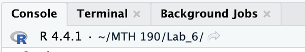
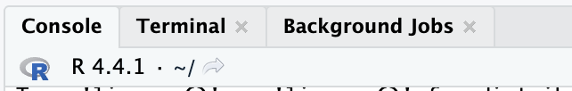

## Cheat Sheet

See the cheatsheet for all the options.

[Quarto Cheatsheet](https://rstudio.github.io/cheatsheets/html/quarto.html)

## Pre-Quarto

(2004) Markdown is a general document format that my documents use and support. It is still a common standard.

(2005) Jupyter notebooks were made for doing data analysis in Python.

(2006) RMarkdown was made specifically for document types involving built in R script.

(2007) Posit introduced quarto that supports working with Python, R, Julia and other languages.

## Global Options

You can change options globally by editing the YAML.

```{r}
#| eval: false
---
...
execute: 
  echo: true
  code-fold: true
...
---
```

You can change options locally by adding #\| in code chunks.

## Showing code

`#| echo: True` option

`#| code-fold: True` option

## Running code

`#| eval: True` option (default)

Runs the code in the chunk.

`#| include: True` option (default)

Runs the code and shows the results.

## Open Lab 5 to experiment.

## Creating other documents

[Presentations](https://quarto.org/docs/presentations/)

[Websites](https://quarto.org/docs/websites/)

[Books](https://quarto.org/docs/books/)

[Pdfs](https://quarto.org/docs/output-formats/pdf-basics.html)

# Working Directory

## What is a directory

A directory is the current folder R considers when working with your file.

Most computer languages need the directory to be specified so the computer know where to find files.

## Working directory

We have been creating R projects to specify a working directory.

This is the easiest method for maintaining a working directory.

## What is my working directory?

RStudio tells you the working directory in the console.

Here R is looking for files in my /MTH190/Lab 6 folder



If I close the project R will look in the home folder.

File \> Close Project



## Another working directory

When rendering a quarto document the working directory is automatically set to the folder the quarto document resides in.

This can be confusing. Let's work through an example.

## Example

This will be easiest to follow if you are on the server.

1.  Close any project you are currently working in so your working directory is the home directory.

Your console should look like this:


## The server is a Linux System

This is a side note:

You can also type `getwd()` into the console to verify your directory. This shows my home directory is:

```         
"/u00/rstudio_homes/administration.hcc/nschwab"
```

This is the same as \~

## Make a folder

2.  Let's make a folder and call it practice_wd.

3.  In that folder make a new quarto document.

Notice: Our working directory and the directory our quarto document are in are different.

We'll leave it that way.

(The easiest way to make them match to to start a new R project in the practice_wd folder)

## Check the document's working directory

Make a new chunk and type:

```{r}
#| echo: True
#| eval: False

getwd()

```

Then render the document.

You should notice that the working directory is in the practice_wd folder.

```         
"/u00/rstudio_homes/administration.hcc/nschwab/practice_wd"
```

## WD Confusion

This is confusing for students because while not rendered R is looking for files in the current working directory (home \~) but when rendered R will look in the folder the quarto document is in (\~\practice\_wd)

This will be a big deal when we read data into the document.

## A csv file

The code below will make a dummy data csv file for practice put it into a code chunk in your practice.qmd file.

Note: It should save to your quarto document's working directory (\~\practice\_wd)

```{r}
#| eval: False
#Make some dummy data
df = dplyr::tribble(
    ~my_teacher_supports_me, ~`my_parents_support_me`,
    "Strongly Agree","Strongly Agree",
    "Strongly Agree"," Agree",
    "Neutral","Agree",
    "Agree"," Neutral",
    NA, "Agree",
    "Disagree","Disagree"
)
readr::write_csv(df,"dummy_data.csv")

```

## Read the data

Make a new chunk and read in the data.

If you run this chunk you will get an error:

```{r}
#| eval: False

readr::read_csv("dummy_data.csv")

```

```         
Error: 'dummy_data' does not exist in current working directory ('/u00/rstudio_homes/administration.hcc/nschwab/practice_wd').
```

## Rendering everything works

When rendering everything works fine.

If the current working directory and the directory for the quarto file match this is not a problem.

This is why we make R Projects before each lab and project.

## Questions